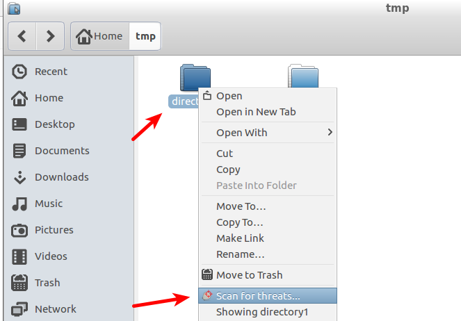
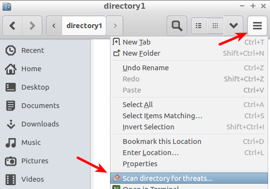
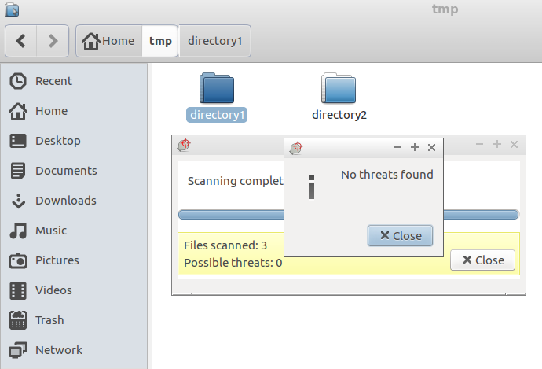

This readme file was last updated 2019 02 17

# README for clamtk-gnome

clamtk-gnome is a simple plugin for
[ClamTk](https://github.com/dave-theunsub/clamtk) to allow a right-click,
context menu scan of files or folders in the Nautilus file manager.

## Installation

### Automatic installation

There are deb and rpm packages to install this plugin:

#### On Debian based systems (Ubuntu etc)

`dpkg -i clamtk-gnome_0.02-1_all.deb`

`apt-get install -f`

#### On CentOS systems

`yum install clamtk-gnome-0.02-1.fc.noarch.rpm`

#### On Fedora systems

`dnf install clamtk-gnome-0.02-1.fc.noarch.rpm`

### Manual installation

1. Install [ClamTk](https://gitlab.com/dave_m/clamtk/wikis/Downloads). You'll need version 5.00 or newer.
2. Additionally, you need to install these packages:
  * For Debian based systems: `python-nautilus`
  * For Red Hat based systems: `nautilus-python`
3. Download the project files
4. As root run `cp clamtk-gnome.py /usr/share/nautilus-python/extensions/`
5. Restart Nautilus

## Usage and screenshots

1. Bring up the context menu either by
   1. right clicking on a directory:
   
   
   
   2. Or by clicking here:
   
   

2. Click on the scan button

3. Wait for the scan to complete (pleate note that it may take a couple of seconds for the scan to start and also for the "No threats found" message to be shown at the end - even after the message "Scanning completed" has been shown)

## Dependencies

* `clamtk` >= 5.00
* On Debian based systems: `python-nautilus`
* On Red Hat based systems: `nautilus-python`

## Links

* https://gitlab.com/dave_m/clamtk-gnome
* https://bitbucket.org/davem_/clamtk-gnome
* https://github.com/dave-theunsub/clamtk-gnome
* http://standards.freedesktop.org/desktop-entry-spec/latest/
* http://code.google.com/p/clamtk/ (no longer used)
* http://dave-theunsub.github.io/clamtk/ (deprecated)

## Contact

* Dave M, dave.nerd at gmail
* Tord D, tord.dellsen at gmail
